# Architecture

## System Overview

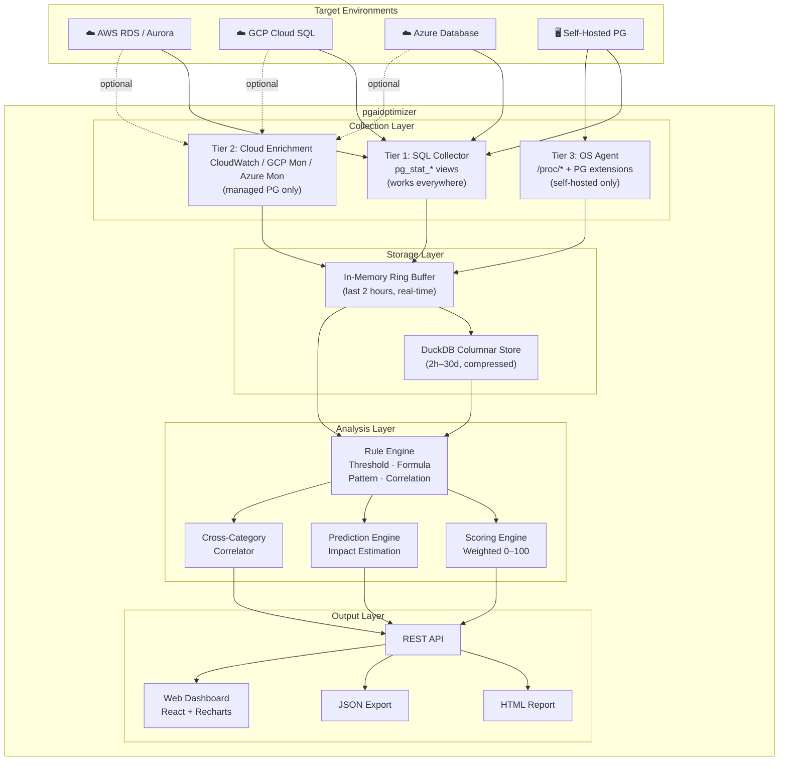

---

## Data Collection Pipeline

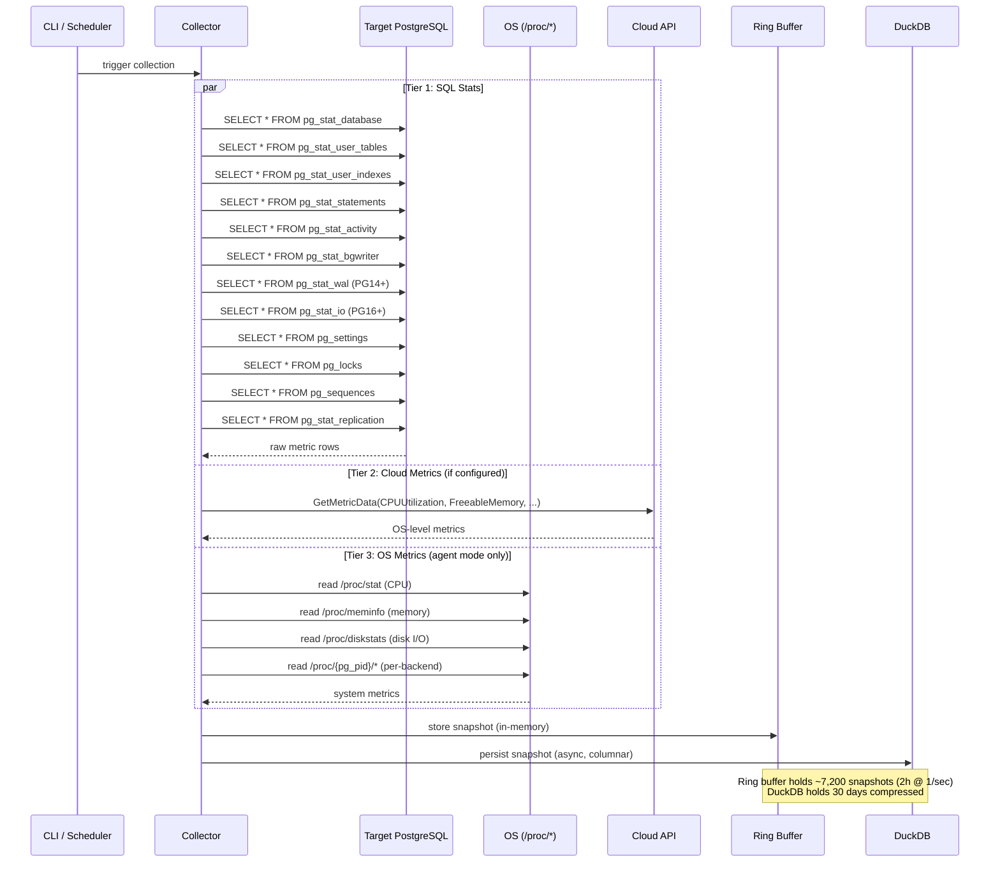

### Collection Timing

| Metric Group | Queries | Avg Latency | Frequency |
|:---|:---|:---|:---|
| Database stats | 3 queries | ~5ms | Every snapshot |
| Table stats | 2 queries | ~10-50ms (depends on table count) | Every snapshot |
| Index stats | 2 queries | ~10-50ms | Every snapshot |
| Query stats | 1 query | ~5-20ms | Every snapshot |
| Connection stats | 1 query | ~3ms | Every snapshot |
| Lock stats | 1 query | ~3ms | Every snapshot |
| Settings | 1 query | ~5ms | Every 5 minutes (rarely changes) |
| Schema info | 3-5 queries | ~20-100ms | Every 15 minutes |
| OS metrics | filesystem reads | ~1ms | Every snapshot (Tier 3) |
| **Total** | **~15-20 queries** | **~50-250ms** | **Every 30-60 seconds** |

---

## Storage Architecture

### Why DuckDB over SQLite

Our query patterns are **analytical** — aggregations over time ranges, rate computations, trend detection. DuckDB is purpose-built for this.

| Query Pattern | SQLite (row-store) | DuckDB (columnar) |
|:---|:---|:---|
| "Avg cache hit ratio over 7 days" | Scans all rows, all columns | Reads only 1 column, vectorized |
| "Top 10 queries by time delta in 24h" | Full join + sort | Columnar join, 10-50x faster |
| "Rate of 15 metrics over 30 days" | ~3 seconds | ~30ms |
| "Downsample to 1h buckets" | Manual GROUP BY, slow | Native window functions, fast |
| Compression ratio | ~1x (no compression) | ~5-10x (columnar + zstd) |
| Storage for 30 days | ~200-500MB | ~30-80MB |

### Storage Tiers

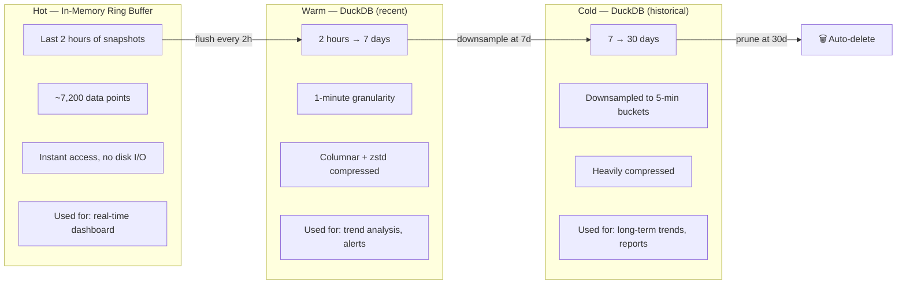

### DuckDB Schema

```sql
-- Snapshot metadata
CREATE TABLE snapshots (
    id            UINTEGER PRIMARY KEY,
    taken_at      TIMESTAMP NOT NULL,
    duration_ms   USMALLINT,
    pg_version    UINTEGER,
    tier          UTINYINT   -- 1=SQL, 2=cloud, 3=agent
);

-- Database-level metrics (one row per snapshot)
CREATE TABLE m_database (
    snapshot_id      UINTEGER NOT NULL,
    taken_at         TIMESTAMP NOT NULL,  -- denormalized for partition pruning
    xact_commit      UBIGINT,
    xact_rollback    UBIGINT,
    blks_read        UBIGINT,
    blks_hit         UBIGINT,
    tup_returned     UBIGINT,
    tup_fetched      UBIGINT,
    tup_inserted     UBIGINT,
    tup_updated      UBIGINT,
    tup_deleted      UBIGINT,
    deadlocks        UBIGINT,
    temp_files       UBIGINT,
    temp_bytes       UBIGINT,
    blk_read_time    DOUBLE,
    blk_write_time   DOUBLE
);

-- Table-level metrics (one row per table per snapshot)
CREATE TABLE m_tables (
    snapshot_id     UINTEGER NOT NULL,
    taken_at        TIMESTAMP NOT NULL,
    schema_name     VARCHAR,
    table_name      VARCHAR,
    seq_scan        UBIGINT,
    seq_tup_read    UBIGINT,
    idx_scan        UBIGINT,
    idx_tup_fetch   UBIGINT,
    n_tup_ins       UBIGINT,
    n_tup_upd       UBIGINT,
    n_tup_del       UBIGINT,
    n_live_tup      UBIGINT,
    n_dead_tup      UBIGINT,
    last_vacuum     TIMESTAMP,
    last_autovacuum TIMESTAMP,
    last_analyze    TIMESTAMP,
    table_bytes     UBIGINT,
    toast_bytes     UBIGINT,
    index_bytes     UBIGINT
);

-- Query metrics from pg_stat_statements (top N per snapshot)
CREATE TABLE m_queries (
    snapshot_id       UINTEGER NOT NULL,
    taken_at          TIMESTAMP NOT NULL,
    queryid           BIGINT,
    query_text        VARCHAR,
    calls             UBIGINT,
    total_exec_time   DOUBLE,
    mean_exec_time    DOUBLE,
    stddev_exec_time  DOUBLE,
    rows              UBIGINT,
    shared_blks_hit   UBIGINT,
    shared_blks_read  UBIGINT,
    temp_blks_read    UBIGINT,
    temp_blks_written UBIGINT,
    blk_read_time     DOUBLE,
    blk_write_time    DOUBLE
);

-- Connection state summary (one row per snapshot)
CREATE TABLE m_connections (
    snapshot_id       UINTEGER NOT NULL,
    taken_at          TIMESTAMP NOT NULL,
    total             USMALLINT,
    active            USMALLINT,
    idle              USMALLINT,
    idle_in_txn       USMALLINT,
    waiting           USMALLINT,
    max_connections   USMALLINT,
    longest_query_sec UINTEGER,
    longest_txn_sec   UINTEGER
);

-- OS metrics (Tier 3 agent only)
CREATE TABLE m_os (
    snapshot_id       UINTEGER NOT NULL,
    taken_at          TIMESTAMP NOT NULL,
    cpu_user_pct      FLOAT,
    cpu_system_pct    FLOAT,
    cpu_iowait_pct    FLOAT,
    cpu_idle_pct      FLOAT,
    mem_total_bytes   UBIGINT,
    mem_available_bytes UBIGINT,
    mem_cached_bytes  UBIGINT,
    mem_buffers_bytes UBIGINT,
    swap_used_bytes   UBIGINT,
    disk_read_ops     UBIGINT,
    disk_write_ops    UBIGINT,
    disk_read_bytes   UBIGINT,
    disk_write_bytes  UBIGINT,
    disk_io_time_ms   UBIGINT
);

-- Downsampled 5-minute rollups (auto-generated)
CREATE TABLE m_database_5m (
    bucket           TIMESTAMP NOT NULL,  -- floor to 5 min
    xact_commit_rate DOUBLE,   -- per second
    blks_read_rate   DOUBLE,
    blks_hit_rate    DOUBLE,
    cache_hit_ratio  DOUBLE,
    tup_fetched_rate DOUBLE,
    deadlocks_delta  UBIGINT,
    temp_files_delta UBIGINT
);
```

### Rate Computation

All `pg_stat_*` counters are cumulative. We compute rates from adjacent snapshots:

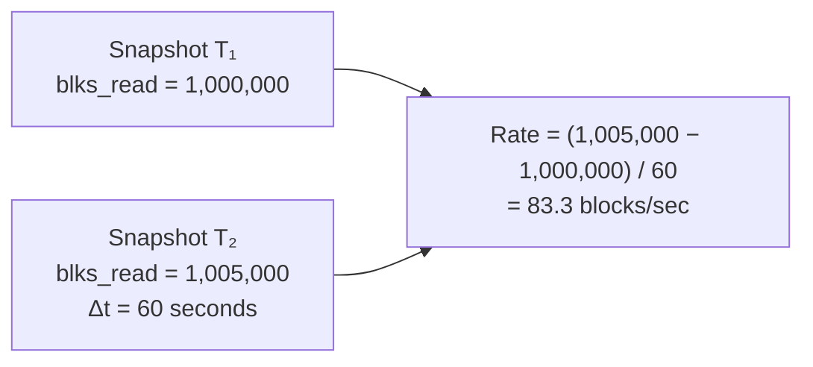

```go
// Rate computation handles counter resets (e.g., pg_stat_reset)
func computeRate(prev, curr uint64, deltaSeconds float64) float64 {
    if curr < prev {
        return 0 // counter was reset, skip this interval
    }
    return float64(curr-prev) / deltaSeconds
}
```

---

## Analysis Engine

### Rule Processing Pipeline

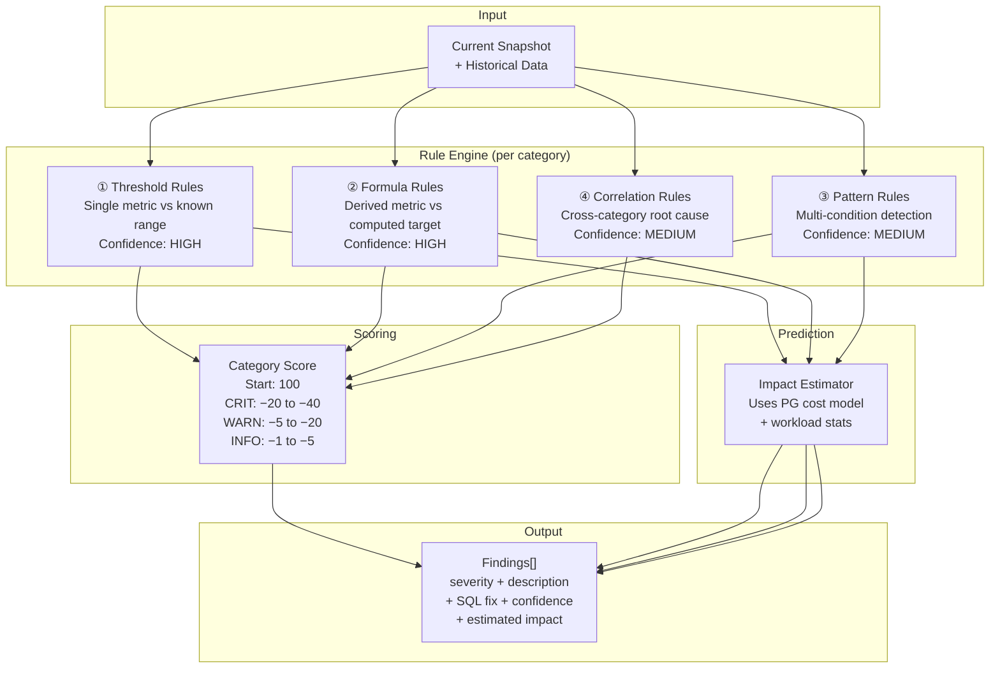

### Rule Type Details

#### ① Threshold Rules — compare metric to known range

```
cache_hit_ratio:
  ≥99%  → OK       (score: −0)
  ≥95%  → OK       (score: −5)
  ≥90%  → INFO     (score: −15)
  ≥80%  → WARNING  (score: −30)
  <80%  → CRITICAL (score: −50)
  confidence: HIGH (direct measurement)

dead_tuple_ratio (per table):
  <5%   → OK
  <10%  → INFO
  <20%  → WARNING  ("VACUUM ANALYZE {table};")
  ≥20%  → CRITICAL ("VACUUM FULL {table}; -- requires exclusive lock")
  confidence: HIGH (exact count from pg_stat_user_tables)

connection_utilization:
  <50%  → OK
  <70%  → INFO
  <85%  → WARNING  ("Consider PgBouncer")
  ≥85%  → CRITICAL ("Risk of connection exhaustion")
  confidence: HIGH (exact from pg_stat_activity vs max_connections)
```

#### ② Formula Rules — compute target from system params

```
shared_buffers:
  recommended = total_ram × 0.25
  IF actual < recommended × 0.6 → WARNING
  IF actual > recommended × 1.6 → INFO (diminishing returns)
  sql_fix: "ALTER SYSTEM SET shared_buffers = '{recommended}';"
  confidence: HIGH (industry standard for 20+ years)

work_mem:
  recommended = (total_ram − shared_buffers) / (3 × max_connections)
  IF actual == 4MB (default)    → WARNING
  IF actual < recommended × 0.5 → WARNING
  sql_fix: "ALTER SYSTEM SET work_mem = '{recommended}';"
  confidence: HIGH (formula from PG docs)

effective_cache_size:
  recommended = total_ram × 0.625  -- midpoint of 50-75%
  IF actual < total_ram × 0.40     → WARNING
  confidence: HIGH (planner hint, no memory allocated)
```

#### ③ Pattern Rules — multi-condition detection

```
missing_index:
  FOR EACH table WHERE:
    seq_scan > 1000
    AND n_live_tup > 100,000
    AND seq_scan > (idx_scan × 10)
  → WARNING
  Tier 3 enhancement: use pg_qualstats to identify which
    columns are filtered, suggest specific index definition
  confidence: MEDIUM (detects symptom, column choice needs verification)

unused_index:
  FOR EACH index WHERE:
    idx_scan = 0
    AND NOT indisunique
    AND NOT indisprimary
    AND stats_age > 7 days
  → INFO
  sql_fix: "DROP INDEX CONCURRENTLY {index_name};"
  confidence: HIGH (binary: used or not, with stats age check)

duplicate_index:
  FOR EACH pair of indexes on same table WHERE:
    index_columns_A == index_columns_B
    OR index_columns_A is prefix of index_columns_B
  → WARNING
  confidence: HIGH (structural comparison)
```

#### ④ Correlation Rules — cross-category root cause analysis

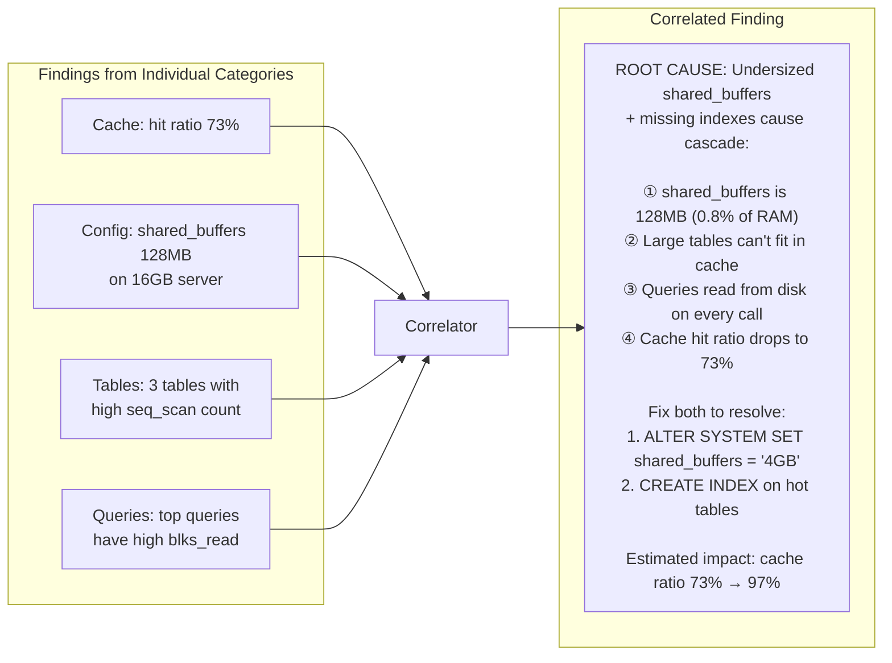

Correlation rules connect findings that share a root cause:

| Pattern | Categories Involved | Root Cause |
|:---|:---|:---|
| Low cache + small buffers + seq scans | Cache, Config, Tables | Undersized memory + missing indexes |
| Temp file spill + default work_mem | Queries, Config | work_mem needs tuning |
| High dead tuples + old vacuum + bloat | Vacuum, Tables, Storage | Autovacuum misconfigured |
| Connection exhaustion + idle conns | Connections, Config | Need connection pooler |
| Replica lag + high WAL rate + many writes | Replication, Storage, Tables | Write-heavy workload outpacing replica |

---

## Prediction & Impact Estimation

### Index Impact Model

Uses PostgreSQL's cost model constants to estimate speedup:

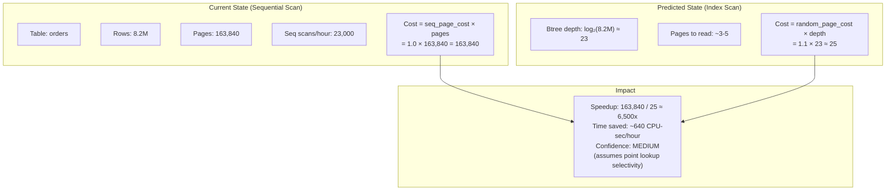

### Configuration Impact Model

| Parameter Change | Estimation Formula | Confidence |
|:---|:---|:---|
| `shared_buffers` ↑ | `Δ_hit_ratio ≈ min(99%, current + (new_size − old_size) / db_size × 100)` | MEDIUM |
| `work_mem` ↑ | Count queries with `temp_blks > 0`. Each: ~3-10x speedup. | MEDIUM |
| `checkpoint_completion_target` → 0.9 | Spreads I/O, reduces spikes ~40% | HIGH |
| `random_page_cost` → 1.1 (SSD) | Planner prefers indexes. Count seq scans with usable indexes. | MEDIUM |
| `max_connections` ↓ + PgBouncer | Saves `N × ~10MB` per idle connection | HIGH |

### Vacuum Impact Model

```
Space recoverable = table_size × (n_dead_tup / (n_live_tup + n_dead_tup))
Scan speedup = 1 / (1 − dead_ratio)

Example: 42% dead tuples on 4.3GB table
  Space savings: 4.3GB × 0.42 = 1.8GB
  Scan speedup: 1 / 0.58 = 1.7x
  Confidence: HIGH (dead tuple count is exact)
```

---

## Accuracy & Confidence Model

Every finding carries a confidence level indicating how reliable the measurement and prediction are.

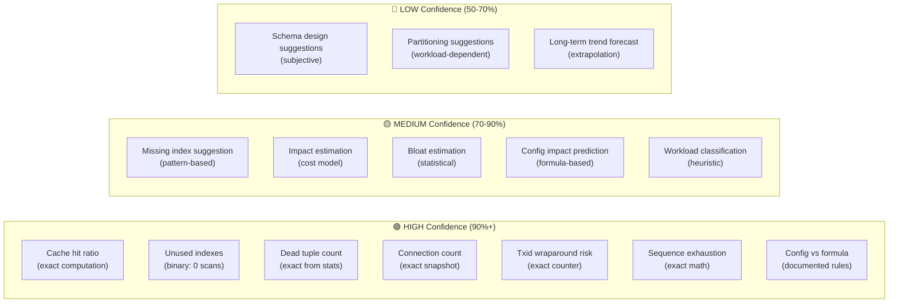

### Validation Commands

Every prediction includes a command the user can run to verify independently:

| Prediction | Verification |
|:---|:---|
| "Query does sequential scan" | `EXPLAIN (ANALYZE, BUFFERS) <query>` |
| "Index would speed up query" | `SET enable_seqscan = off; EXPLAIN ANALYZE <query>;` |
| "Table has ~40% bloat" | `CREATE EXTENSION pgstattuple; SELECT * FROM pgstattuple('table');` |
| "work_mem increase stops disk spill" | `SET work_mem='64MB'; EXPLAIN (ANALYZE, BUFFERS) <query>;` |
| "shared_buffers increase helps" | Compare `pg_stat_database.blks_hit` ratio before/after |

---

## Deployment Architecture

### Scan Mode

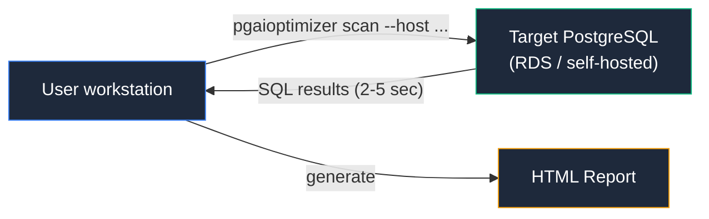

Stateless. Connect → collect → analyze → report → disconnect. No storage.

### Agent Mode

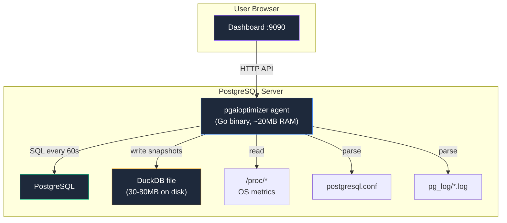

Runs on PG host. Full Tier 3 access. Serves dashboard locally.

### Server Mode (multi-instance)

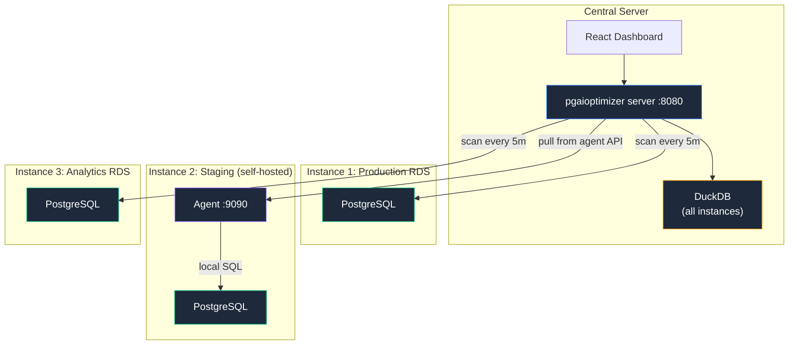

---

## Security Model

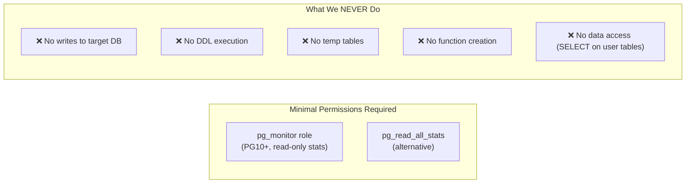

**Recommended connection setup:**
```sql
-- Create a dedicated read-only role
CREATE ROLE pgaioptimizer LOGIN PASSWORD '...';
GRANT pg_monitor TO pgaioptimizer;
-- For pg_stat_statements access:
GRANT EXECUTE ON FUNCTION pg_stat_statements_reset TO pgaioptimizer; -- optional
```

All credentials are stored in memory only during the session (scan mode) or in an encrypted config file (agent/server mode). Never logged, never transmitted.
